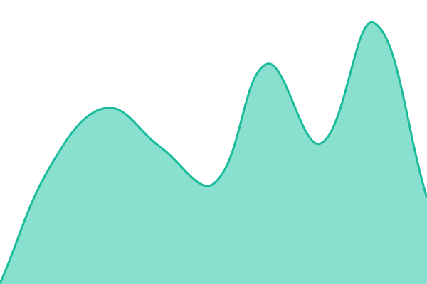
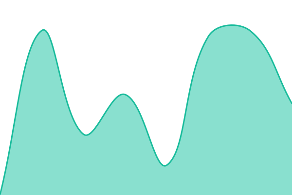
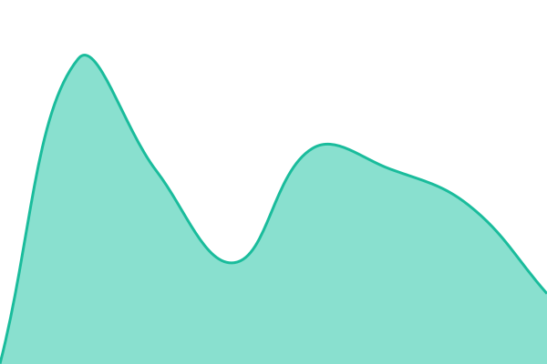

# [📈 Live Status](https://Pathos-Design-Studio.github.io/uptime): <!--live status--> **🟩 All systems operational**

This repository contains the open-source uptime monitor and status page for [Pathos Design Studio](https://Pathos-Design-Studio.github.io/uptime), powered by [Upptime](https://github.com/upptime/upptime).

With [Upptime](https://upptime.js.org), you can get your own unlimited and free uptime monitor and status page, powered entirely by a GitHub repository. We use [Issues](https://github.com/Pathos-Design-Studio/uptime/issues) as incident reports, [Actions](https://github.com/Pathos-Design-Studio/uptime/actions) as uptime monitors, and [Pages](https://Pathos-Design-Studio.github.io/uptime) for the status page.

<!--start: status pages-->
<!-- This summary is generated by Upptime (https://github.com/upptime/upptime) -->
<!-- Do not edit this manually, your changes will be overwritten -->
<!-- prettier-ignore -->
| URL | Status | History | Response Time | Uptime |
| --- | ------ | ------- | ------------- | ------ |
|  [Fresh Aire Mechanical](https://freshairemech.com/) | 🟩 Up | [fresh-aire-mechanical.yml](https://github.com/Pathos-Design-Studio/uptime/commits/HEAD/history/fresh-aire-mechanical.yml) | 

 301ms
     
 | 

<a href="https://Pathos-Design-Studio.github.io/uptime/history/fresh-aire-mechanical">79.36%</a>
    

|  [JLB Remodels](https://www.jlbremodels.com/) | 🟩 Up | [jlb-remodels.yml](https://github.com/Pathos-Design-Studio/uptime/commits/HEAD/history/jlb-remodels.yml) | 

 300ms
     
 | 

<a href="https://Pathos-Design-Studio.github.io/uptime/history/jlb-remodels">100.00%</a>
    

|  [The Amandla Project](https://www.amandlaproject.org/) | 🟩 Up | [the-amandla-project.yml](https://github.com/Pathos-Design-Studio/uptime/commits/HEAD/history/the-amandla-project.yml) | 

 573ms
     
 | 

<a href="https://Pathos-Design-Studio.github.io/uptime/history/the-amandla-project">81.43%</a>
    

<!--end: status pages-->

[**Visit our status website →**](https://Pathos-Design-Studio.github.io/uptime)

## 📄 License

- Powered by: [Upptime](https://github.com/upptime/upptime)
- Code: [MIT](./LICENSE) © [Anand Chowdhary](https://anandchowdhary.com), supported by [Pabio](https://pabio.com)
- Data in the `./history` directory: [Open Database License](https://opendatacommons.org/licenses/odbl/1-0/)
